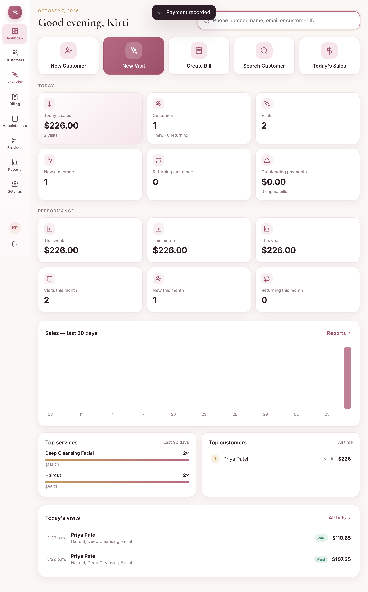

# Salon Manager — Kirti's Beauty Parlour

A simple, elegant salon management app for iPad and Mac: customer lookup by phone number, check-in, billing, receipts, customer history, dashboard, reports and Google Drive backups.



## What it does

- **Find customers in seconds** by phone number (on-screen number pad on iPad), name, email or customer ID. Duplicate phone numbers are flagged before a second record is made.
- **New Visit** is check-in and billing on one screen: pick the customer, tap services (or "Same as last time"), add a discount, choose Cash / Debit / Credit Card / E-transfer / Other or split the payment, and finish.
- **Receipts** with a permanent number (INV-2026-000001): print, download PDF, email, or save to Google Drive.
- **Customer profile** with total visits, total spent, average visit, favourite services, outstanding balance, general notes and the complete visit history.
- **Dashboard** with today's sales, customers, new vs returning, outstanding payments, week/month/year sales, top services and top customers.
- **Reports** for sales (daily/weekly/monthly/yearly/custom), customers, services, payments, staff and customer spending, exportable to CSV and PDF.
- **Services** you manage yourself (categories, prices, duration, taxable, on/off). Price changes never alter past receipts.
- **Canadian tax** set in Settings (HST/GST rate, prices with or without tax). Each receipt keeps the tax it was charged. Amounts in CAD.
- **Appointments**: book, reschedule, cancel and mark no-shows; a week view; start the visit straight from a booking. Bookings are copied to the Google Calendar you choose, and customers can get confirmation and reminder emails.
- **Backups**: automatic hourly backup (or once a day), Backup Now, restore, and copies in your own Google Drive. **Export All Data** to Excel or CSV.
- **Owner and staff logins** with permissions, and an audit log that cannot be edited.

The design decisions (database schema, architecture, Google Drive approach, security review and open questions) are in [docs/PLAN.md](docs/PLAN.md).

---

## Run it at the salon: Mac + iPad on the same Wi-Fi

The app runs on one Mac at the salon. The iPad (and any other device on the salon Wi-Fi) opens it in Safari. All data stays on that Mac, with hourly copies in your Google Drive. Nothing to install on the iPad.

### 1. Set up the Mac (once)

1. Install **Node.js** (LTS version) from <https://nodejs.org> — download the macOS installer and click through it.
2. Download this app: on GitHub, press **Code › Download ZIP**, then unzip it into a folder you'll keep, e.g. `Documents/Salon Manager`.
3. Open that folder and **double-click `Start Salon.command`**.
   - The first time, macOS may say it can't be opened: right-click it, choose **Open**, then **Open** again.
   - The first start installs what it needs (about a minute).
   - If macOS asks whether "node" may accept incoming network connections, choose **Allow** (the iPad needs this).
4. A window shows the addresses, for example:
   ```
   On this computer:   http://localhost:3000
   On the iPad (Wi-Fi): http://Kirtis-MacBook-Air.local:3000
                     or http://192.168.1.23:3000
   ```
5. On the Mac, open **http://localhost:3000** in Safari or Chrome. The app opens straight to the dashboard: there is no setup screen and no password by default.
6. Go to **Services** and add your services and prices (the list starts empty). Then go to **Settings** to add the salon address, phone, logo and tax settings.
7. Optional: to require a password, go to **Settings › My Account** and choose **Turn on sign-in**. Without it, anyone on your Wi-Fi who opens the app has full access.

Keep the `Start Salon.command` window open while the salon is open (you can minimise it). It also keeps the Mac awake so the iPad can always connect. To stop the app, close the window or press Ctrl+C in it.

**Start automatically when the Mac turns on:** System Settings › General › Login Items › press **+** under "Open at Login" and choose `Start Salon.command`.

### 2. Set up the iPad (once)

1. Make sure the iPad is on the **same Wi-Fi** as the Mac.
2. Open **Safari** and type the iPad address shown in the Mac window, e.g. `http://Kirtis-MacBook-Air.local:3000`.
   If the `.local` name doesn't load, use the number address (e.g. `http://192.168.1.23:3000`).
3. The dashboard opens (or the sign-in screen, if you turned sign-in on).
4. Tap the **Share** button › **Add to Home Screen** › **Add**. The salon app now opens full-screen from its own icon, like a normal app.

Tips:
- The number address can change when the router restarts. The `.local` name doesn't. To make the number address permanent, reserve it for the Mac in your Wi-Fi router's settings ("DHCP reservation").
- Use the salon's private, password-protected Wi-Fi, not a guest network.
- Printing from the iPad works with any AirPrint printer (Receipt › Print).

### 3. Keep the iPad working when the Mac is off (recommended)

If the Mac is asleep, off or out of Wi-Fi range, the iPad keeps checking customers in and taking payment. New customers and visits are saved on the iPad, a banner shows how many are waiting, and they're sent to the Mac when it's back. The Mac gives the final customer IDs and receipt numbers at that point, so numbers never clash. If a phone number was added on both devices, the iPad asks whether it's the same person.

Offline mode needs a one-time step so Safari keeps a copy of the app: on the Mac, open **Settings › iPad & Offline** and follow the 4 steps there (install the salon certificate on the iPad, then use the `https://…:3443` address). Without it, offline mode still works, but only while the app stays open on the iPad.

Works offline: customer lookup, new customers, check-in, services, discounts and payment. Needs the Mac: reports, receipts, editing past records, settings and backups. Entries saved offline live only on that iPad until they sync, so don't clear Safari's website data while the banner shows items waiting.

### 4. Turn on Google Drive backups (recommended)

Settings › **Backup & Data** walks you through it. In short:

1. At <https://console.cloud.google.com> create a free project, enable the **Google Drive API**, set up the OAuth consent screen (External; add your Gmail as a test user), and create an **OAuth client ID** of type **Web application** with the redirect URI shown on the Backup page (e.g. `http://localhost:3000/api/drive/callback`).
2. Paste the Client ID and Client secret into the Backup page, then press **Connect Google Drive**. Do this **on the Mac** at `http://localhost:3000` (Google only allows plain `http` addresses for localhost).
3. A `Beauty Parlour` folder appears in your Drive with `Backups`, `Reports`, `Receipts` and `Exports`. A backup is uploaded every hour while the app is running (skipped when nothing has changed), and whenever you press **Backup Now**. Every backup from the last 2 days is kept, then one per day for 30 days; older automatic backups are removed from the Mac and from Drive. You can switch to once a day in Settings › Backup & Data.

The app can only see the files it creates in your Drive, nothing else.

### 5. Appointments in Google Calendar (optional)

Uses the same Google app as step 4.

1. In the same Google Cloud project, enable the **Google Calendar API**. If the calendar is in a different Google account from the one used for Drive, add that account under **OAuth consent screen › Test users**.
2. On the Mac at `http://localhost:3000`, open Settings › Appointments, enter the Google account, and press **Connect Google Calendar**. Allow access to calendar events.
3. Pick which calendar bookings go into. Bookings made, moved or cancelled in the app are copied to it (changes made in Google Calendar are not copied back). If the internet is down, the app keeps the booking and copies it later.
4. To change account or calendar later, use **Use a different Google account** or the calendar picker on the same page; upcoming bookings move across.

Confirmation and reminder emails to customers go out from the mailbox set up in step 6.

**Customer booking page (optional).** The app also serves a small customer-only site on `127.0.0.1:3080`: a "Book now" page (`/book`) and one page per booking (`/a/<signed link>`) where customers confirm, cancel or pick a new free time. Point a tunnel at that port only, for example Tailscale Funnel (`tailscale funnel --bg 3080`, free, keeps the same address), then in Settings › Appointments › Customer booking page enter the https address and tick the options. Nothing else in the app is reachable through it.

### 6. Email receipts (optional)

Settings › **Email**. For Gmail: turn on 2-Step Verification, create an **App password** at <https://myaccount.google.com/apppasswords>, then enter `smtp.gmail.com`, port `587`, your Gmail address and the app password. Press **Send test**.

### Where your data is

Everything is in the `data` folder next to the app:
- `data/salon.db` — the database
- `data/backups/` — automatic and manual backups
- `data/secret.key` — encrypts the saved Google and email passwords; keep it with the app
- `data/https/` — the salon's own certificate for the iPad's secure address

**Moving to a new Mac:** set up the app on the new Mac (steps 1–3), connect Google Drive, then Settings › Backup & Data › **Restore from Drive**. Or copy the whole `data` folder across before the first start.

---

## Running it in the cloud instead (optional)

For access from anywhere with HTTPS, run the included `Dockerfile` on a small server (Render, Fly.io, Railway or a $5 VPS) with a persistent disk mounted at `/data`, behind HTTPS. Set `SECURE_COOKIES=1` and `TRUST_PROXY=1`, and set the app address in Settings so Google Drive's redirect URI uses it. Same app, same data model.

Environment variables: `PORT` (3000), `HTTPS_PORT` (3443), `HTTPS=0` (turn off the https listener), `HOST` (0.0.0.0), `DATA_DIR` (./data), `SECURE_COOKIES`, `TRUST_PROXY`, `APP_SECRET` (instead of `data/secret.key`), `GOOGLE_CLIENT_ID` / `GOOGLE_CLIENT_SECRET` (instead of entering them in Settings).

## For developers

```bash
npm install
npm start          # http://localhost:3000
npm test           # API, money, Google Drive and Calendar tests (node:test)
```

Browser walkthrough at iPad and Mac sizes (needs Playwright installed globally; writes screenshots to `test-output/`):

```bash
NODE_PATH=$(npm root -g) node scripts/e2e.js
NODE_PATH=$(npm root -g) node scripts/e2e-offline.js   # offline mode and sync
```

Layout: `server/` (Express app, SQLite schema in `server/migrations.js`, routes and libraries), `public/` (the browser app, plain JS modules and CSS, no build step), `test/`, `scripts/`, `docs/`.
